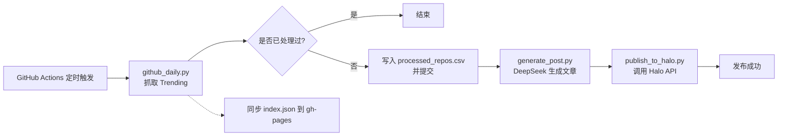

# onedaygithub

> 每日自动抓取 GitHub Trending 热门项目，借助 DeepSeek AI 生成技术博客，并发布到 Halo 博客。

## 项目简介

`onedaygithub` 是一个完全自动化的「GitHub Trending → AI 博客文章 → Halo 发布」流水线。通过 GitHub Actions 每天定时运行，依次完成：

1. 抓取 [GitHub Trending](https://github.com/trending) 上当天的热门仓库；
2. 通过 DeepSeek 大模型为该项目撰写结构化、可读性强的技术介绍文章；
3. 自动调用 Halo Console API，将文章发布到 [veyvin.com](https://veyvin.com)（小伞帝的 Halo 博客）。

> 📸 这是使用本项目自动生成、并最终呈现在 Halo 博客（小伞帝）上的文章示例：


## 功能特性

- 🔥 **每日 Trending 抓取**：使用 `requests` + `BeautifulSoup` 抓取 GitHub Trending 页面，解析仓库名、链接、描述、Star 数等关键信息。
- 🧠 **DeepSeek AI 写稿**：调用 DeepSeek 大模型，根据项目特点动态选择 6 种文章结构模板（故事型 / 对比型 / 技术深度型 / 场景驱动型 / 探索发现型 / 问题解决型），让每天的推荐都不重样。
- 📝 **HTML 内容生成**：文章以 HTML 格式输出，标题带 emoji，所有 `<h2>/<h3>` 都带 `id` 锚点，方便阅读与目录跳转。
- 🏷️ **自动分类与标签**：自动确保 Halo 中存在对应的分类（`GitHub Trending`、`开源项目`）与标签（`GitHub`、`Trending`、`自动发布` 等），并按项目名/描述智能推导技术关键词标签。
- 🗂️ **去重机制**：通过 `processed_repos.csv` 记录已经处理过的仓库 URL，避免短期内重复推荐。
- ⏰ **北京时间发布**：自动将 GitHub 的 UTC 日期转换为北京时间，统一设置 `publishTime` 为 `T08:00:00+08:00`。
- 🛡️ **容错重试**：所有网络请求均带 3 次重试，兼容 Cloudflare 530 等瞬时错误。
- 🌐 **gh-pages 同步**：将当日 trending 数据同步推送到 `gh-pages` 分支，供前端静态页面使用。

## 目录结构

```
onedaygithub/
├── .github/
│   └── workflows/
│       └── daily.yml        # GitHub Actions 定时任务
├── README.md                # 本文件
├── generate_post.py         # 调用 DeepSeek 生成博客文章
├── github_daily.py          # 抓取 GitHub Trending 并去重
├── publish_to_halo.py       # 发布文章到 Halo
├── requirements.txt         # Python 依赖
├── processed_repos.csv      # 已处理仓库记录（自动维护）
├── github_daily.json        # 当日 Trending 数据
├── generated_post.json      # DeepSeek 生成的文章（中间产物）
└── index.json               # gh-pages 用索引
```

## 快速开始

### 1. 准备环境变量 / Secrets

在 GitHub 仓库 `Settings → Secrets and variables → Actions` 中配置：

| Secret 名称 | 说明 |
| --- | --- |
| `DEEPSEEK_API_KEY` | DeepSeek 平台的 API Key，用于生成博客内容 |
| `HALO_TOKEN` | Halo Console 的 Personal Access Token（需具备 `posts:manage` 权限） |
| `GITHUB_TOKEN` | GitHub Actions 自带，无需手动配置（用于回写 CSV 与推送 gh-pages） |

> 💡 默认的 Halo 站点地址为 `https://veyvin.com`，可在 `publish_to_halo.py` 中通过环境变量 `HALO_URL` 覆盖。

### 2. Fork / 克隆仓库

```bash
git clone https://github.com/<your-username>/onedaygithub.git
cd onedaygithub
pip install -r requirements.txt
```

### 3. 本地手动跑一遍

```bash
# 1) 抓取 trending（会自动写 processed_repos.csv）
python github_daily.py

# 2) 用 DeepSeek 生成文章（需要环境变量 DEEPSEEK_API_KEY）
export DEEPSEEK_API_KEY=sk-xxx
python generate_post.py

# 3) 发布到 Halo（需要环境变量 HALO_TOKEN）
export HALO_TOKEN=pat-xxx
python publish_to_halo.py
```

### 4. 触发自动任务

工作流 `.github/workflows/daily.yml` 默认每天 **UTC 00:00**（北京时间 08:00）执行一次。
也可以在 Actions 页面点击 **Run workflow** 手动触发。

## 工作流程



## 核心实现说明

### 多样化文章模板
为避免每天的推荐文章「千人一面」，`generate_post.py` 会基于项目名生成一个稳定 hash，并从 6 种预设结构中随机挑选一种作为文章骨架，再交给 DeepSeek 自由发挥。不同项目（框架 / CLI / 前端 UI / 后端基础设施）会得到风格迥异的文章。

### Slug 生成策略
`publish_to_halo.py` 中的 `generate_unique_slug()` 使用 `github-trending-{日期}-{项目名}` 形式的 slug：
- 解决 Halo 中文章名称重复的问题；
- 同一项目同一天不会重复发布；
- 跨天复用同一项目时也能保证唯一性。

### 分类与标签解析
`resolve_categories_and_tags()` 会先拉取 Halo 中已存在的分类/标签：
- 命中已有的 → 直接使用其 `metadata.name`；
- 未命中的 → 自动 POST 创建；
- 创建失败 → 退回到列表中的第一项作为 fallback，保证文章始终能挂上至少一个分类/标签。

## 常见问题

**Q: 为什么我的 Halo 站点发布失败？**
A: 请确认 `HALO_TOKEN` 是 Halo 2.x 的 Personal Access Token，且具备「文章管理」相关权限。可以在 Halo 控制台 `个人中心 → 令牌` 创建。

**Q: 想换大模型怎么办？**
A: 修改 `generate_post.py` 中 `DEEPSEEK_API_URL` 与 `payload["model"]` 即可，例如改为 `https://api.openai.com/v1/chat/completions` 配合 `gpt-4o`。

**Q: 如何修改发布频率？**
A: 编辑 `.github/workflows/daily.yml` 的 `cron` 字段即可。注意 GitHub Actions 定时为 UTC 时区。

**Q: processed_repos.csv 越来越大怎么办？**
A: 仓库在 GitHub 上可以保留任意大小。如需重置历史推荐，删掉该文件后重新运行工作流即可重新推荐。

## License

MIT
